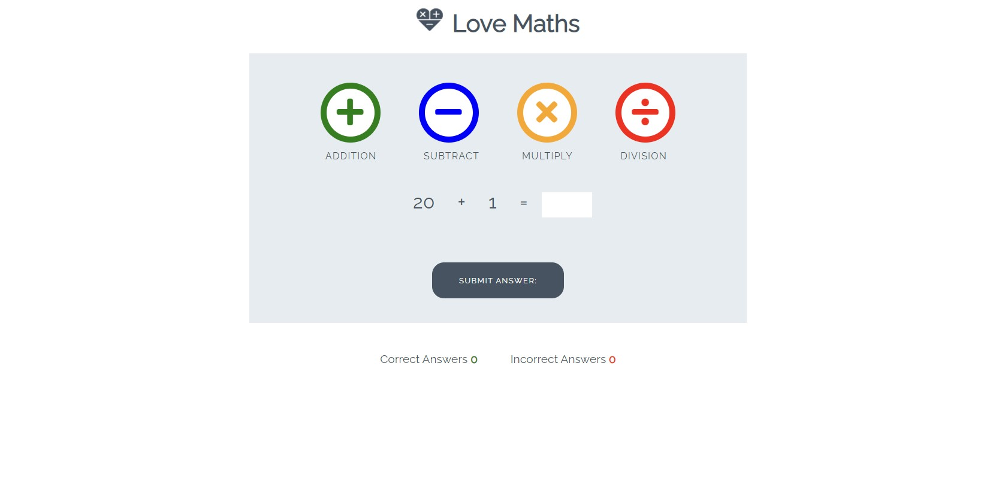

Welcome, This is a walkthrough project provided by the Coding Institute. Along the way I learnt how to apply JavaScript to an interactive level and how to read the DOM to manipulate the elements on the page to create a game. please click on the link below to go to the site and see it in action!!! :)

https://grantwils23.github.io/Love-Maths-Walkthrough-Project/

As part of this project, the coding institute helped me understand the relationship between the DOM and the web page, how the event listeners play their role in how the game should operate and what are their responsibilities are. The challange to this walkthrough project was to come up with some code that performs the division game, which was tricky but upon understanding the question that the first number has to be divisable without leaving any remainder and the first number has to be bigger than the second number, I came up with an answer. The game is fully functional, try it out for yourself and give it a go! 

<!--Second method to display a screenshot -->

<!--  -->